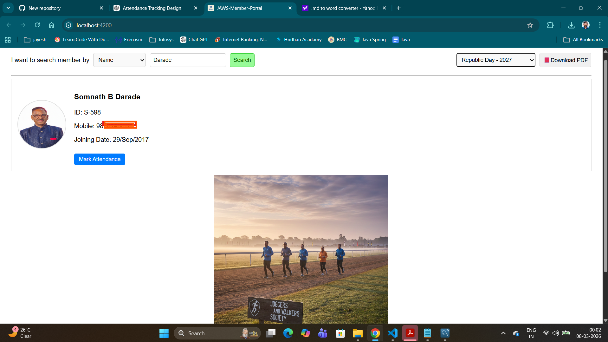

# Member Portal

A **Member Search and Event Attendance Management Portal** built using
**Angular, Spring Boot, and MySQL**.

This application allows administrators to **search members, manage
member data, and record attendance for events** conducted by the
organization.

------------------------------------------------------------------------

# Tech Stack

Frontend\
- Angular 19\
- TypeScript\
- Bootstrap / CSS

Backend\
- Spring Boot 4.0.3\
- Java 17\
- REST APIs

Database\
- MySQL

Tools\
- Git\
- GitHub\
- Postman

------------------------------------------------------------------------

# Features

### Member Management

-   Search members by:
    -   Membership Number
    -   Name
    -   Mobile Number
-   View member details
-   Store member photos

### Event Management

-   Create and manage yearly events
-   Track event date and details

### Attendance Tracking

-   Mark attendance for members who attend events
-   Store only **present members**
-   Prevent duplicate attendance

### Reports

-   Generate attendance reports for each event
-   View list of members present in events

------------------------------------------------------------------------

# Project Structure

    member-portal
    │
    ├── src
    │   ├── app
    │   │   ├── components
    │   │   ├── services
    │   │   └── models
    │   │
    │   ├── assets
    │   └── environments
    │
    ├── angular.json
    ├── package.json
    └── README.md

------------------------------------------------------------------------

# Development Server

Run the following command to start the Angular development server:

``` bash
ng serve
```

Open your browser and navigate to:

    http://localhost:4200

The application will automatically reload when you modify source files.

------------------------------------------------------------------------

# Build Project

To build the Angular project:

``` bash
ng build
```

Build output will be generated in:

    dist/

------------------------------------------------------------------------

# Install Dependencies

Before running the project, install required packages:

``` bash
npm install
```

------------------------------------------------------------------------

# Backend API

The Angular application communicates with **Spring Boot REST APIs**.

Example API endpoints:  /members

@GET    /byMembershipNo/{membershipNo}
@GET    /byName/{name}
@GET    /byMobileNo/{mobileNo}
@GET    /downloadPDF/{eventId}
@GET    /events
@POST   /attendance
@POST   /bulk-photo-upload

------------------------------------------------------------------------

# Database Schema

Main Tables:

    membership_details
    events
    event_attendance

### membership_details

Stores member information.

### events

Stores event details.

### event_attendance

Stores attendance of members for events.

------------------------------------------------------------------------

# Future Improvements

-   QR Code based attendance
-   Member Add / Edit / Remove Option
-   Event  Add / Edit / Remove Option
-   Host this project online

------------------------------------------------------------------------

# Author

**Sagar Darade**

------------------------------------------------------------------------

# License

This project is for learning and internal organization use.

------------------------------------------------------------------------

# Application Screenshots

